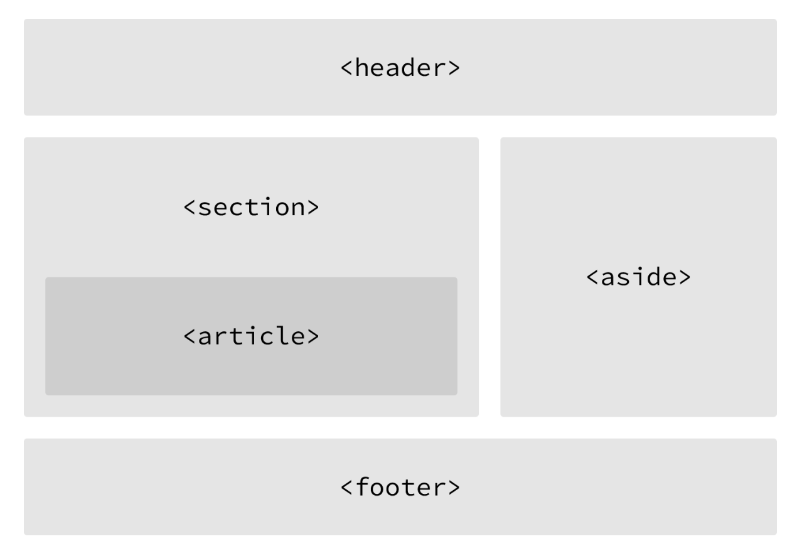

<a href="#lesson1">Lesson 1</a> | <a href="#lesson2">Lesson 2</a> | <a href="#lesson3">Lesson 3</a>

#HTML/CSS Basics for Designers

###LESSON 2: More about HTML

-----

### Lesson 2 Topics

1. `
`s and ``s
2. Text-based elements
	- Headings (`h1` - `h6`)
	- `
`, `<strong>`, and `<em>` tags
3. Building structure (thanks, HTML5!)
	- `<header>`, `<nav>`, `<article>`, `<section>`, `<footer>` ...
4. Making hyperlinks
	- `<a>` tags
	- Relative/absolute paths
	- email addresses
	- links in new window
	- anchor linking

	
### 1) `
`s and ``s
- Both `
`s and ``s, however, are extremely valuable when building a website in that they give us the ability to apply targeted styles to a contained set of content.

- A `
` is a block-level element that is commonly used to identify large groupings of content, and which helps to build a web page’s layout and design. A ``, on the other hand, is an inline-level element commonly used to identify smaller groupings of text within a block-level element.

### 2) Text-based elements

- **Headings** should be used in an order that is relevant to the content of a page. The primary heading of a page or section should be marked up with an `<h1>` element, and subsequent headings should use `<h2>`, `<h3>`, `<h4>`, `<h5>`, and `<h6>` elements as necessary.

	- Each heading level should be used where it is semantically valued, and should not be used to make text bold or big—there are other, better ways to do that.

- **Paragraphs** are defined using the `
` block-level element. Paragraphs can appear one after the other, adding information to a page as desired.
- **Bolding text**: use the `<strong>` tag
- **Italic text**: use the `<em>` tag

### 3) Building Structure

- For a long time, structure was created with divisions, but there was no semantic value.
	- Semantics: Naming your code in a descriptive way so 
	- See: <https://boagworld.com/dev/semantic-code-what-why-how/> 
- HTML5 has introduced better naming of elements to make things easier for programmers and also for things like search engines and accessibility.
	- EXAMPLES: `<header>`, `<nav>`, `<article>`, `<section>`, `<footer>`
	- What to use is largely based on content.
		- Both the `<article>` and `<section>` elements contribute to a document’s structure and help to outline a document. If the content is being grouped solely for styling purposes and doesn’t provide value to the outline of a document, use the `
` element.
	- **See Example 2**

### 4) Making hyperlinks
- Along with text, one of the core components of the Internet is the hyperlink, which provides the ability to link from one web page or resource to another.
- Relative & Absolute Paths
	- `<a href="about.html">About</a>`
	- `<a href="http://www.google.com/about.html">About Google</a>`
- Emails
	- `<a href="mailto:dgnojek@ku.edu">Email Me</a>`

### 5) The Box Model
reference: <http://learn.shayhowe.com/html-css/opening-the-box-model/>

###<a href="#top">TO TOP</a>