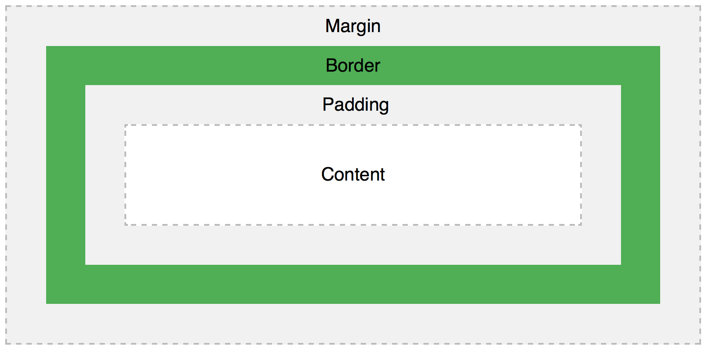
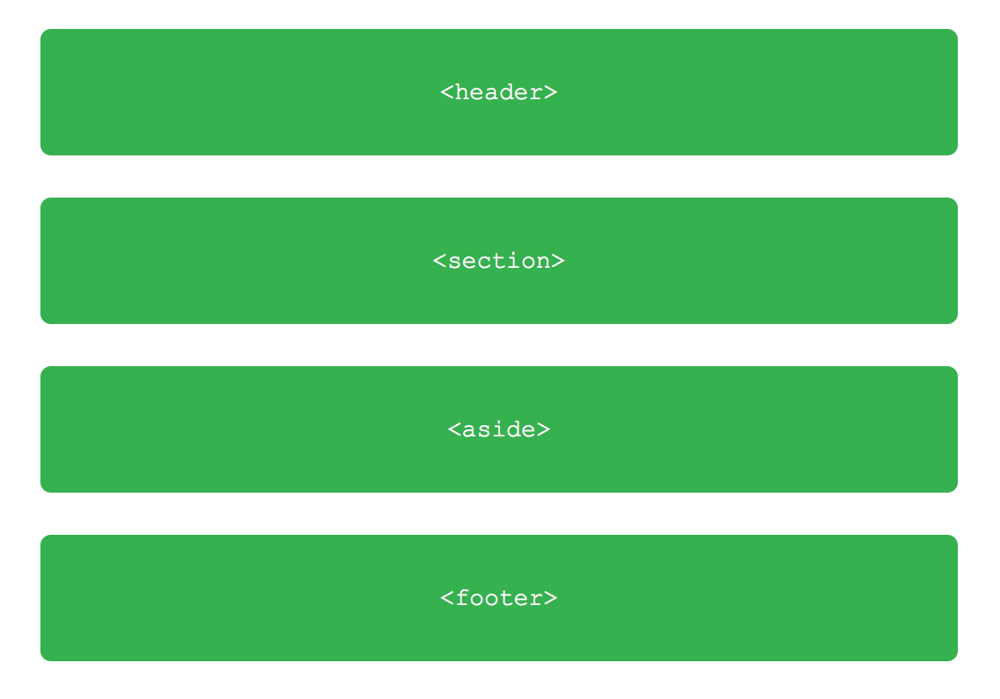
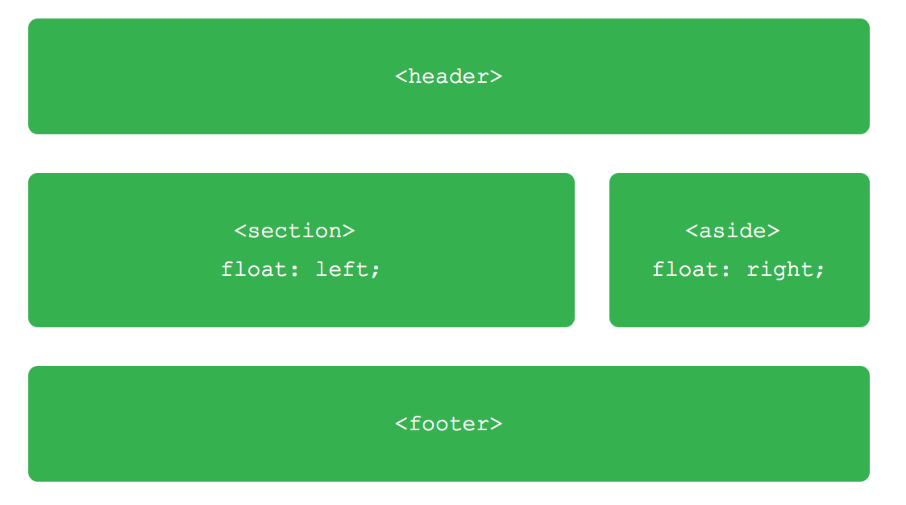
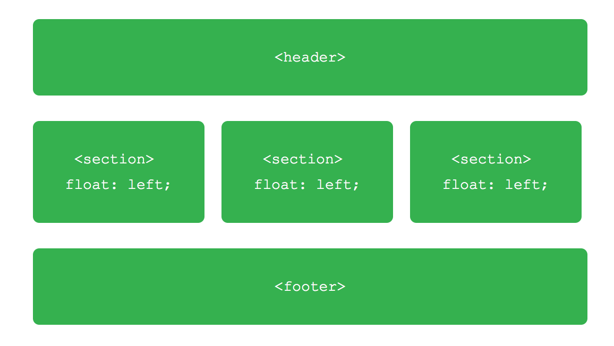

<a href="#lesson1">Lesson 1</a> | <a href="#lesson2">Lesson 2</a> | <a href="#lesson3">Lesson 3</a>

#HTML/CSS Basics for Designers

###LESSON 4: Positioning with CSS

-----

### Lesson 4 Topics

1. Revisiting the Box Model
2. Displaying content 
3. Positioning Content - Floats
4. Positioning Content - Relative/Absolute positioning
5. CSS Frameworks

### 1) The Box Model - a review
reference: <http://learn.shayhowe.com/html-css/opening-the-box-model/>

### 2) Displaying content 

- Inline, block, inline-block, none
- Block-level elements have a default width of 100%, consuming the entire horizontal space available. Inline and inline-block elements expand and contract horizontally to accommodate their content. 

### 3) Positioning Content - Floats
- Floats allow you to take an element and remove it from the standard page flow and position it to the left or right of another element.

			<header>...</header>
			<section>...</section>
			<aside>...</aside>
			<footer>...</footer>

#### Two Column Float Example

			section {
			  	float: left;
				}
			aside {
			 	float: right;
				}
				
#### Three Column Float Example

HTML

			<header>...</header>
			<section>...</section>
			<section>...</section>
			<section>...</section>
			<footer>...</footer>

CSS

			section {
				  float: left;
				  margin: 0 1.5%;
				  width: 30%;
				}

- Clearing floats
	- Floats can sometimes force unwanted elements to wrap around floated content. In that case, you'll need to "clear" the float ('left', 'right', or 'both'):
	
			div {
			  clear: both;
			}

####Floats can applied to a wide range of elements. One great use of floats is in navigation.
<ul>
	<li>Menu Item 1</li>
	<li>Menu Item 2</li>
	<li>Menu Item 3</li>
	<li>Menu Item 4</li>
</ul>

HTML

			<ul>
				<li>Menu Item 1</li>
				<li>Menu Item 2</li>
				<li>Menu Item 3</li>
				<li>Menu Item 4</li>
			</ul>
With a `display: block;`, `list-style-type: none;` and `float: left`, you can make the menu items line up.

**Menu Item 1 &nbsp; &nbsp; Menu Item 2   &nbsp; &nbsp;  Menu Item 3  &nbsp; &nbsp;   Menu Item 4**

### 4) Positioning Content - Relative/Fixed/Absolute positioning

- An element with `position: relative;` is positioned relative to its normal position. Setting the top, right, bottom, and left properties of a relatively-positioned element will cause it to be adjusted away from its normal position. Other content will not be adjusted to fit into any gap left by the element.

- An element with `position: fixed;` is positioned relative to the viewport (screen), which means it always stays in the same place even if the page is scrolled. The top, right, bottom, and left properties are used to position the element.

- An element with `position: absolute;` is positioned relative to the nearest positioned ancestor (instead of positioned relative to the viewport, like fixed). However; if an absolute positioned element has no positioned ancestors, it uses the document body, and moves along with page scrolling.

### 5) CSS FRAMEWORKS

- Bootstrap - big player
- Others include Foundation, Skeleton, Blueprint, HTML5 Boilerplate, Pure, Base . . .
- You should determine if a framework is useful or not
- They often have lots of built-in features like a layout grid, float properties, button and form styling, etc. BUT, it can be overfill for small projects.

			###<a href="#top">TO TOP</a>